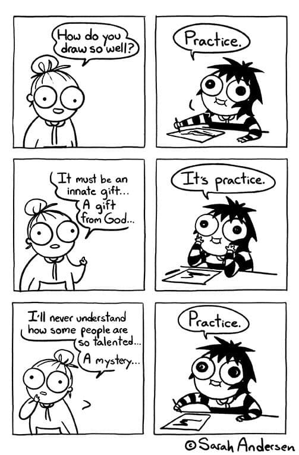

# Everything in life is practice
 
This image describes very well what I mean by “everything in life is practice.”
 

 
Stop thinking you will get better at something magically. You have to work on it to accomplish it.
 
If you want to master something in life, you have to practice it. Anything. Little by little. The key is not performing a lot, it is about being constant and practice a bit now and then.
 
It is true that some people are more capable than others to do some kind of things. However, if you practice enough, you can reach them, even surpass them if you really want to
 
To make sure you will practice, plan and book a time to do so.

## Quotes
 
> For the things we have to learn before we can do them, we learn by doing them. – Aristotle
 
> My father taught me that the only way you can make good at anything is to practice and then practice some more. – Pete Rose
 
> There is no glory in practice, but without practice, there is no glory. – Unknown
 
> The more you practice, the better you get, the more freedom you have to create. – Jocko Willink

## Related advices
 
- [Eating an elephant](../Eating%20an%20elephant/index.md)
- [If you want, you can](../If%20you%20want,%20you%20can/index.md)
- [Book time for planning](../Book%20time%20for%20planning/index.md)
- [Set up reminders](../Set%20up%20reminders/index.md)
- [Set up goals](../Set%20up%20goals/index.md)