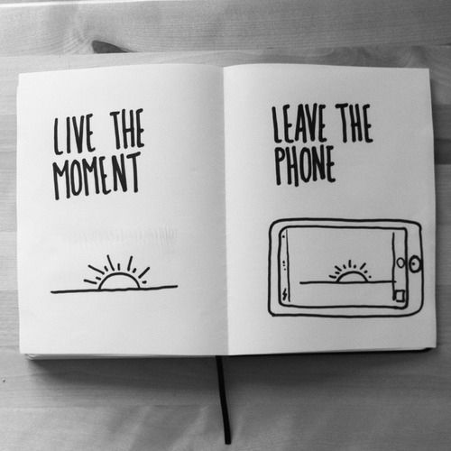

# Put your phone down

When you are _doing something_, but you are paying attention to your phone, you are not doing it fully.

Take some quick pictures or videos to remember the moment in the future if you want to. However, try to waste the least time doing it.

If you are in a social moment like eating with friends or family, pay attention to it. Try not to be on the phone. If you decide to watch a movie, enjoy it, pay attention to it and the moment.

Try not to be looking at the phone all the time in public places or public transport. Pay attention to your surroundings.

## Quotes

> “Do more things that make you forget to check your phone.” — Anonymous

> Your cell phone has already replaced your camera, your calendar and your alarm clock. Don't let it replace your family. — Anonymous

> Life is what happens when your cell phone is charging. — Anonymous

> “Put down your cell phones, put everything away, and feel your blood pulsing in you, feel your creative impulse, feel your own spirit, your heart, your mind. Feel the joy of being alive and free.” — Patti Smith

> Put your phone down. Your texts will be there later but person in front of you won't — Anonymous

## Related advices

- [Empathic listening](../Empathic%20listening/index.md)
- [Don't waste time on social media](../Don't%20waste%20time%20on%20Social%20Media)
- [Pay attention](../Pay%20attention/index.md)
- [Enjoy the moment](../Enjoy%20the%20moment/index.md)