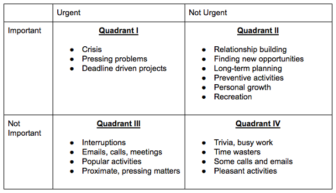

# The Eisenhower Matrix

The Eisenhower Matrix is a great method for setting priorities and goals.

Use it from time to time to evaluate your current task and overall progress.

The "Eisenhower Method" stems from a quote attributed to Dwight D. Eisenhower: "I have two kinds of problems, the urgent and the important. The urgent are not important, and the important are never urgent." Eisenhower does not claim this insight for his own, but attributes it to an (unnamed) "former college president."

Using the Eisenhower Decision Principle, tasks are evaluated using the criteria important/unimportant and urgent/not urgent.

The four quadrants:

**Quadrant 1: Urgent and important** 

Tasks in this box of the Eisenhower matrix include deadlines, crises and problems that require your immediate attention and are also important for achieving your goals.

Examples include: responding to urgent emails, work deadlines and so on.

Tasks in this box should be proactively eliminated in advance, when they were previously in the quadrant 1 box.

**Quadrant 2: Important but not urgent**

Tasks in this quadrant don’t have a deadline around the corner, but they are important for achieving your goals.

Examples include: exercising, planning, recreation, journaling, studying, family time.

Ideally, we should spend majority of our time on tasks in this box,

**Quadrant 3: Urgent but not important**

Activities in this box of the Eisenhower matrix are generally urgent interruptions that don’t help us to achieve our goals.

Examples include: responding to urgent emails, meetings, phone calls or messages from friends, family or work colleagues.

The danger with activities in this box, is that they can often deceptively appear to be quadrant 1 activities.

They also give us a sense of achievement and satisfaction from crossing them off our to-do list, when in reality we haven’t made much progress.

Try to delegate as many tasks as you can from here.

**Quadrant 4: Not important and not urgent**

Tasks in this box of the Eisenhower matrix are typically time-wasting activities that don’t help you to achieve your long-term goals. Tasks that you should stop doing.

Examples include: Mindlessly browsing through social media, surfing the web, playing video games and watching TV.

If we’re being honest, we often spend the majority of our time on activities in this box.

You can try to, instead of eliminating activities in this box, minimize them and use them as a reward.

**The Difference Between Urgent and Important**

The key to making the most out of the Eisenhower Matrix work is distinguishing between what is urgent and what is important.

Urgent tasks are typically time sensitive and require our immediate attention. They force you to be reactive, anxious and stressed.

Conversely, important tasks put you in a proactive and strategic mode. They contribute to your long-term goals and give you more time to make better decisions—to avoid stupid decisions.

The more time you spend on activities that are important but not urgent, the more proactive and productive you will be.

One of the best ways to distinguish between urgent and important tasks is to:

Define and write down what is important i.e. life goals, core values, and practice self-awareness to identify urges or impulses to react to a given task. These tasks are typically urgent.

**Optimization and Delegation**

What happens when you don’t have enough time for an activity or can’t decide how to fit them all inside the Eisenhower matrix?

Is there a way to maximize our productivity using the Eisenhower matrix, with the least time and effort spent?

The answer to these lies within the use of optimization and delegation.

Delegation involves giving away the completion of a task to something or someone else, i.e. booking a driver instead of walking, a colleague writing a report or email on your behalf etc.

Optimization involves the elimination of anything that is not absolutely necessary for the completion of a goal i.e. cutting out ‘fillers’ or ‘fluff’ from a piece of writing, cutting out clients or customers that don’t add value etc.

Here’s how it works, illustrated within this useful 2-step question checklist:

Q1 (the optimization question): Does this task need to be done?

If yes, go to Q1.

If no – Eliminate the task entirely.

Q2 (the delegation question)- Can this task be delegated to someone else to do it for me?

If yes, delegate.

If no, assess if the task fits into your life goals and treat accordingly.

## Quotes

> "I have two kinds of problems, the urgent and the important. The urgent are not important, and the important are never urgent." – Dwight D. Eisenhower

> “We accomplish all that we do through delegation, either to time or to other people” – Stephen Covey

## Resources and acknowledgments

Most of the text above comes from what I learned from Stephen Covey’s book The 7 Habits of Highly Effective People.

## Related advices

- [Learn to delegate](Learn%20to%20delegate/index.md)
- [Book time for planning](Book%20time%20for%20planning/index.md)