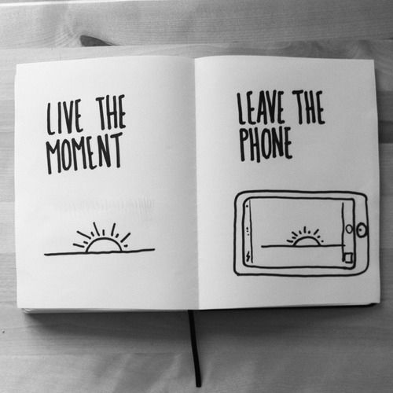

# Put your phone down

When you are _doing something_, but you are paying attention to your phone, you are not doing it fully.

When you are in a social moment like eating with friends or family, pay attention to the moment and don't be on the phone. If you decide to watch a movie, watch it, enjoy it, pay attention to the movie and the moment.

Don't be looking at the phone all the time.

If you are at a festival, don't be recording the whole performance. Make a small video or photo for the memories and keep the phone. Pay attention to it rather than wasting time on the phone.

## Quotes

> “Do more things that make you forget to check your phone.” — Anonymous

> Your cell phone has already replaced your camera, your calendar and your alarm clock. Don't let it replace your family. — Anonymous

> Life is what happens when your cell phone is charging. — Anonymous

> “Put down your cell phones, put everything away, and feel your blood pulsing in you, feel your creative impulse, feel your own spirit, your heart, your mind. Feel the joy of being alive and free.” — Patti Smith

> Put your phone down. Your texts will be there later but person in front of you won't — Anonymous

## Related advices

- [Emphathic listening](../Emphathic%20listening/index.md)
- [Don't waste time on social media](../Don't%20waste%20time%20on%20Social%20Media)
- [Pay attention](../Pay%20attention/index.md)
- [Enjoy the moment](../Enjoy%20the%20moment/index.md) [Categories:](../Categories/index.md) [Health](../Categories/Health.md) [Respect](../Categories/Respect.md) [Communication](../Categories/Communication.md)