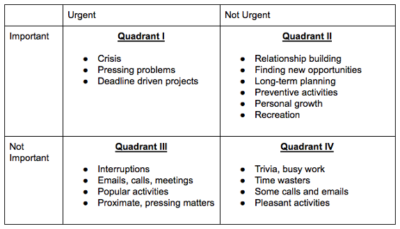

[categories:](../categories/index.md) [Time](../categories/Time.md) [Time management](../categories/Time%20management.md) [Goals](../categories/Goals.md) [Prioritize](../categories/Prioritize.md)
# The Eisenhower Matrix

Where does the name come from?

Dwight D. Eisenhower was the 34th President of the United States from 1953 until 1961. Before becoming President, he served as a general in the United States Army and as the Allied Forces Supreme Commander during World War II. He also later became NATO’s first supreme commander. Dwight had to make tough decisions continuously about which of the many tasks he should focus on each day. This finally led him to invent the world-famous Eisenhower principle, which today helps us prioritize by urgency and importance.

The four quadrants:

Quadrant 1: Important but not urgent

Tasks in this quadrant don’t have a deadline round the corner, but they are important for achieving your goals.

Examples include: exercising, journaling, studying, family time.

Ideally, we should spend majority of our time on tasks in this box,

Quadrant 2: Urgent and important

Tasks in this box of the Eisenhower matrix include deadlines, crises and problems that require your immediate attention and are also important for achieving your goals.

Examples include: responding to urgent emails, work deadlines and so on.

Tasks in this box should be proactively eliminated in advance, when they were previously in the quadrant 1 box.

Quadrant 3: Not important and not urgent

Tasks in this box of the Eisenhower matrix are typically time-wasting activities that don’t help you to achieve your long-term goals.

Examples include: Mindlessly browsing through social media, surfing the web, playing video games and watching TV.

If we’re being honest, we often spend the majority of our time on activities in this box. I’ve personally struggled to stay focused and avoid the distractions of YouTube videos on the web.

What has worked for me isn’t necessarily eliminating activities in this box, but instead minimizing and using them as a reward for my productive hours during the day.

Quadrant 4: Urgent but not important

Activities in this box of the Eisenhower matrix are generally urgent interruptions that don’t help us to achieve our goals.

Examples include: responding to urgent emails, phone calls or messages from friends, family or work colleagues.

The danger with activities in this box, is that they can often deceptively appear to be quadrant 2 activities.

They also give us a sense of achievement and satisfaction from crossing them off our to-do list, when in reality we haven’t made much progress.

The Difference Between Urgent and Important
The key to making the most out of the Eisenhower Matrix work is distinguishing between what is urgent and what is important.

Urgent tasks are typically time sensitive and require our immediate attention. They force you to be reactive, anxious and stressed.

Conversely, important tasks put you in a proactive and strategic mode. They contribute to your long-term goals and give you more time to make better decisions—to avoid stupid decisions.

The more time you spend on activities that are important but not urgent, the more proactive and productive you will be.

The best ways I’ve found to distinguish between urgent and important tasks is to:

Define and write down what is important i.e. life goals, core values and
Practice self awareness to identify urges or impulses to react to a given task. These tasks are typically urgent.
Delegation and Optimisation
“We accomplish all that we do through delegation, either to time or to other people”

– Stephen Covey

What happens when you don’t have enough time for an activity or can’t decide how to fit them all inside the Eisenhower matrix?

Is there a way to maximize our productivity using the Eisenhower matrix, with the least time and effort spent?

The answer to these lies within the use of optimisation and delegation.

Delegation involves giving away the completion of a task to something or someone else i.e. booking a driver instead of walking, a colleague writing a report or email on your behalf etc.

Optimisation involves the elimination of anything that is not absolutely necessary for the completion of a goal i.e. cutting out ‘fillers’ or ‘fluff’ from a piece of writing, cutting out clients or customers that don’t add value etc.

Here’s how it works, illustrated within this useful 2-step question checklist:

Q1 (the optimisation question): Does this task need to be done?

If yes, go to Q2.

If no – Eliminate the task entirely.

Q2 (the delegation question)- Can this task be delegated to someone else to do it for me?

If yes, delegate.

If no, assess if the task fits into your life goals and treat accordingly.

## Quotes

> "I have two kinds of problems, the urgent and the important. The urgent are not important, and the important are never urgent."
> – Dwight D. Eisenhowe

> “We accomplish all that we do through delegation, either to time or to other people”
> – Stephen Covey

## Resources

- The 7 Habits of Highly Effective People book by Stephen Covey

## Credits

I learned this reading Stephen Covey’s book 7 habits book

## Related advices:
There are no advices related to this one

- 

[categories:](../categories/index.md) [Time](../categories/Time.md) [Time management](../categories/Time%20management.md) [Goals](../categories/Goals.md) [Prioritize](../categories/Prioritize.md)