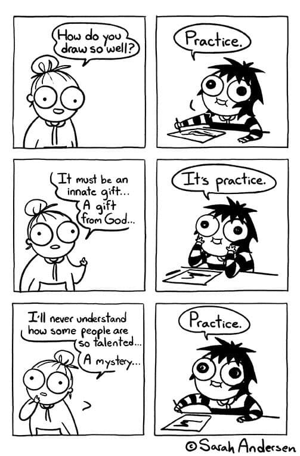

[categories:](categories/index.md) [Goals](../categories/Goals.md) [Practice](../categories/Practice.md)
# Everything in life is practice

If you want to master something in life you have to practice it. Anything. Little by little.

If your goal is to improve at something you have to practice

## Quotes

- Eating an elephant

## Resources

## Credits

## Related advices:

- Little by little
[categories:](categories/index.md) [Goals](../categories/Goals.md) [Practice](../categories/Practice.md)